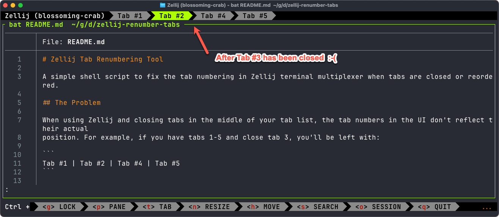

# Zellij Tab Renumbering Tool

A simple shell script to fix the tab numbering in Zellij terminal multiplexer when tabs are closed or reordered.

## The Problem

When using Zellij and closing tabs in the middle of your tab list, the tab numbers in the UI don't reflect their actual
position. For example, if you have tabs 1-5 and close tab 3, you'll be left with:

```
Tab #1 | Tab #2 | Tab #4 | Tab #5
```

This creates confusion since the keyboard shortcuts to access tabs are based on position, not the displayed number.



The problem also occurs when you use descriptive custom tab names like "Coding", "Project K", e.g. by renaming the current tab via `Ctrl t r` or some script like `zellij-rename-tab`:

```shell
#!/usr/bin/env sh
command nohup zellij action rename-tab "$1" >/dev/null 2>&1
```

This issue is documented in the [Zellij GitHub repository](https://github.com/zellij-org/zellij/issues/3709), which was
the inspiration for this script. This script enhances the original script posted in  that issue by [ivanrg99](https://github.com/ivanrg99) with additional features
and configuration options (e.g. to respect descriptive custom tabs names or different numbering preferences).

## The Solution

This script automatically renumbers all your tabs to match their actual position while preserving custom tab names.

Before:

```
Tab #1 | Coding #2 | Tab #4 | Projects #5
```

After running the script:

```
Tab #1 | Coding #2 | Tab #3 | Projects #4
```

## Features

- ✅ Preserves custom tab names while updating numbers
- ✅ Configurable naming format through environment variables
- ✅ Works on both macOS and Linux
- ✅ Handles various numbering styles (prefix, suffix)
- ✅ Option to add numbers to tabs without them

## Installation

1. Download the script to a directory in your PATH:

```bash
curl -o ~/.local/bin/zellij-renumber-tabs https://raw.githubusercontent.com/datentyp/zellij-renumber-tabs/main/zellij-renumber-tabs.sh
chmod +x ~/.local/bin/zellij-renumber-tabs
```

2. Add a keybinding in your Zellij config file (`~/.config/zellij/config.kdl`):

```kdl
keybinds {
    tab {
        bind "m" { Run "zellij-renumber-tabs"; }
    }
}
```
`m` isn't a mnemonic for "renumber", but like to use `Ctrl t m` because it is unused, and it works well with `Ctrl t n` to create new tabs.

## Usage

Simply run the script while Zellij is active:

```bash
zellij-renumber-tabs
```

Or use your configured keybinding.

## Configuration

You can customize the behavior by setting environment variables:

| Variable                 | Default      | Description                                                                         |
|--------------------------|--------------|-------------------------------------------------------------------------------------|
| `DEFAULT_TAB_NAME`       | `"Tab"`      | Base name for tabs without custom names                                             |
| `NUMBERING_FORMAT`       | `" #NUMBER"` | Format for the number part (use "NUMBER" as placeholder)                            |
| `ADD_NUMBERS_TO_UNNAMED` | `true`       | Whether to add numbers to tabs with custom names but without number (e.g. "coding") |
| `NUMBER_POSITION`        | `"end"`      | Where to place numbers: `"start"` or `"end"`                                        |

### Examples

```bash
# Use dash instead of hash for numbering (Tab-1 instead of Tab #1)
DEFAULT_TAB_NAME="Tab" NUMBERING_FORMAT="-NUMBER" zellij-renumber-tabs

# Use numbered dots at the start (1. Coding instead of Coding #1)
NUMBER_POSITION="start" NUMBERING_FORMAT=". " zellij-renumber-tabs

# Don't add numbers to tabs with custom names
ADD_NUMBERS_TO_UNNAMED=false zellij-renumber-tabs
```

## Adding to Your Zellij Startup

To renumber tabs automatically whenever you start Zellij, add this to your shell startup file (`.bashrc`, `.zshrc`,
etc.):

```bash
# Add this to your shell startup file
alias zellij='zellij; zellij-renumber-tabs'
```

## How It Works

The script:

1. Marks the current tab with a temporary name
2. Gets all tab names using Zellij's query command
3. Extracts custom names while removing old numbers
4. Renames each tab with its custom name and new position-based number
5. Returns to the original tab

## Compatibility

- Requires Zellij 0.35.0 or later
- Works on macOS and Linux
- Requires Bash or compatible shell, and sed

## License

MIT License

## Contributing

Contributions are welcome! Feel free to open issues or submit pull requests.

---

This tool is not officially affiliated with the Zellij project.
